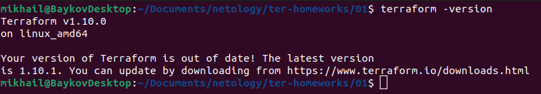
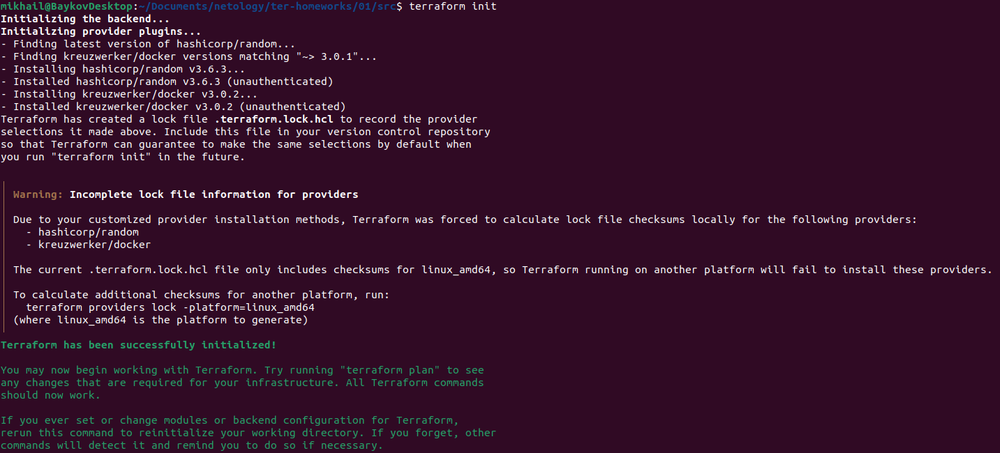
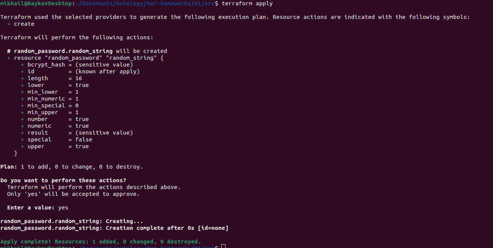
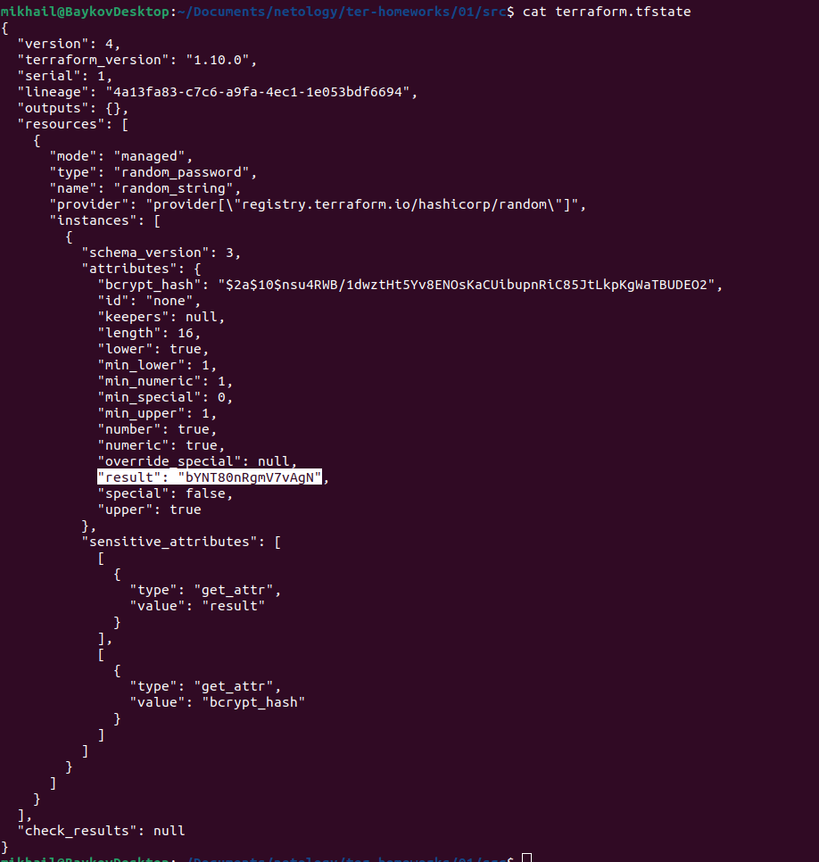
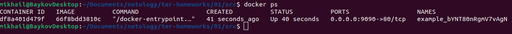
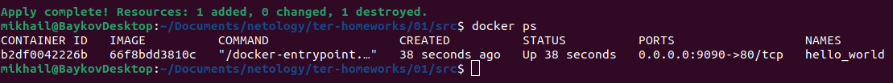

# Домашнее задание к занятию «Введение в Terraform» -- Байков Михаил

### Чек-лист готовности к домашнему заданию

1. Скачайте и установите **Terraform** версии >=1.8.4 . Приложите скриншот вывода команды ```terraform --version```.



### Задание 1

1. Перейдите в каталог [**src**](https://github.com/netology-code/ter-homeworks/tree/main/01/src). Скачайте все необходимые зависимости, использованные в проекте. 
2. Изучите файл **.gitignore**. В каком terraform-файле, согласно этому .gitignore, допустимо сохранить личную, секретную информацию?(логины,пароли,ключи,токены итд)
3. Выполните код проекта. Найдите  в state-файле секретное содержимое созданного ресурса **random_password**, пришлите в качестве ответа конкретный ключ и его значение.
4. Раскомментируйте блок кода, примерно расположенный на строчках 29–42 файла **main.tf**.
Выполните команду ```terraform validate```. Объясните, в чём заключаются намеренно допущенные ошибки. Исправьте их.
5. Выполните код. В качестве ответа приложите: исправленный фрагмент кода и вывод команды ```docker ps```.
6. Замените имя docker-контейнера в блоке кода на ```hello_world```. Не перепутайте имя контейнера и имя образа. Мы всё ещё продолжаем использовать name = "nginx:latest". Выполните команду ```terraform apply -auto-approve```.
Объясните своими словами, в чём может быть опасность применения ключа  ```-auto-approve```. Догадайтесь или нагуглите зачем может пригодиться данный ключ? В качестве ответа дополнительно приложите вывод команды ```docker ps```.
8. Уничтожьте созданные ресурсы с помощью **terraform**. Убедитесь, что все ресурсы удалены. Приложите содержимое файла **terraform.tfstate**. 
9. Объясните, почему при этом не был удалён docker-образ **nginx:latest**. Ответ **ОБЯЗАТЕЛЬНО НАЙДИТЕ В ПРЕДОСТАВЛЕННОМ КОДЕ**, а затем **ОБЯЗАТЕЛЬНО ПОДКРЕПИТЕ** строчкой из документации [**terraform провайдера docker**](https://docs.comcloud.xyz/providers/kreuzwerker/docker/latest/docs).  (ищите в классификаторе resource docker_image )

### Решение 1

1. Инициализируем терраформ, скачиваем провайдеры.  
	  
2. Судя по маскам в файле .gitignore секреты можно хранить в любых файлах в директориях с именем .terraform, а так же в файле оканчивающихся на .terraform* (например .terraformsec). А так же в файле personal.auto.tfvars. Поскольку они будут проигнорированы при коммитах.
3. 
		> "result": "bYNT80nRgmV7vAgN"  
	
	  
	  
4. У ресурса docker_image отсутствует имя, требуется указывать тип и имя. Во втором случае допущена ошибка в имени. Имя не может начинаться на цифру. Так же присутствует две ошибки в параметре name ресурса docker_container.  
5. 
		>  resource "docker_image" "nginx" {
		>   name         = "nginx:latest"
		>   keep_locally = true
		> }
		> 
		> resource "docker_container" "nginx" {
		>   image = docker_image.nginx.image_id
		>   name = "example_${random_password.random_string.result}"
		>   ports {
		>     internal = 80
		>     external = 9090
		>   }
		> }

	  
6. auto-approve молча подтверждает все изменения. Если изменения были внесены ошибочно они все равно будут применены. Теряется возможность перепроверки применяемых изменений, однако это может быть полезно при использовании в пайплайнах, для автоматизации в ci/cd системах.  
		
8. Содержимое **terraform.tfstate** после уничтожения ресурсов.  
		
		>  {
		>   "version": 4,
		>   "terraform_version": "1.10.0",
		>   "serial": 11,
		>   "lineage": "4a13fa83-c7c6-a9fa-4ec1-1e053bdf6694",
		>   "outputs": {},
		>   "resources": [],
		>   "check_results": null
		> }
9. Образ не был удален так как в ресурсе docker_image используется параметр keep_locally в значении true.  

Выдержка из документации:  

		> **keep_locally** (Boolean) If true, then the Docker image won't be deleted on destroy operation. If this is false, it will delete the image from the docker local storage on destroy operation.


